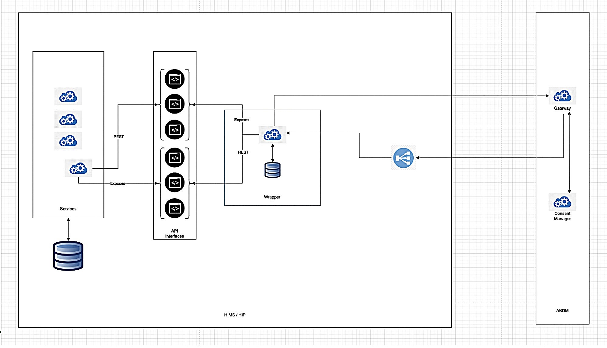

# ABDM Wrapper
The Ayushman Bharat Digital Mission (ABDM) is a government initiative that aims to develop a digital health infrastructure for India. An overview of ABDM can be found [here](https://github.com/NHA-ABDM/ABDM-wrapper/wiki/ABDM-Overview). The ABDM aims to improve the efficiency and transparency of healthcare data transfer between patients, medical institutions, and healthcare service providers. It also allows patients to securely store their medical information and share with others as needed.
The National Health Authority (NHA) is implementing Ayushman Bharat Digital Mission (ABDM) to create a digital health ecosystem for the country. ABDM intends to support different healthcare facilities like clinics, diagnostic centers, hospitals, laboratories and pharmacies in adopting the ABDM ecosystem to make available the benefits of digital health for all the citizens of India.
In order to make any digital solution ABDM compliant, it has to go through 3 milestones and obtain AND certification.
- Milestone 1: ABHA Id creation, verification and obtaining link token
- Milestone 2: Linking and exporting health data
- Milestone 3: Sending a consent request and importing data from other applications in the ecosystem

ABDM Wrapper is created to solve the challenges and issues faced by integrators to bring their systems into ABDM ecosystem.
Wrapper aims to abstract complex workflows and algorithms exposing clean and simple interfaces for integrators.
Wrapper abstracts implementation of HIP and HIU workflows involved in **Milestone 2** and **Milestone 3**.

## Architecture


Wrapper is a springboot application packaged with mongodb database.
Wrapper can be deployed on existing HMIS's / health facility's infrastructure.

There are sets of interfaces which wrapper exposes and the existing services 
need to invoke them to implement ABDM workflows.

At the same time if HMIS is an HIP, then existing services should expose a set 
of interfaces which wrapper needs to invoke to get information from
health providers.

The callback apis which gateway would be making to wrapper should be behind
facility's firewall.

## Pre-requisites
### 1. Install ABHA SBX PHR App on your mobile.

> https://sandbox.abdm.gov.in/docs/phr_app


### 2. Create ABHA Address

```
* Skip if ABHA Address already exists.

ABHA Address can be created using: 
- Mobile Number
- Aadhaar Number
- E-mail

After creating the ABHA Address, your id should look like "yourAbha@sbx"
```

### 3. System Requirements and Installations:
There are two ways to get wrapper and related applications running on your system:
#### 1. Using docker (Preferred): This is an easy way to get wrapper up and running.
Install docker and docker-compose: You can install docker desktop from [here](https://www.docker.com/products/docker-desktop/) to get both.

System Requirements:
- For Mac, check [here](https://docs.docker.com/desktop/install/mac-install/)
- For Windows, check [here](https://docs.docker.com/desktop/install/windows-install/)
- For Linux, check [here](https://docs.docker.com/desktop/install/linux-install/)

Using default docker-compose.yaml, you can bring up wrapper and mongodb services.
Using compose-wrapper-mockgateway.yaml, you can bring up wrapper, mongodb and mock gateway services.

This repository provides two other services:
- Sample HIP
- Sample HIU

If you need to bring these services up, then you need to install gradle from [here](https://gradle.org/install/)

#### 2. If you are facing issues with installing or running docker, then you can install individual components:
- Install mongodb from [here](https://www.mongodb.com/docs/manual/installation/)
- Install jdk 17. Instructions can be found [here](https://www3.cs.stonybrook.edu/~amione/CSE114_Course/materials/resources/InstallingJava17.pdf)
- Install gradle from [here](https://gradle.org/install/)

System Requirements:
- For Mongodb, you can check [here](https://www.mongodb.com/docs/manual/administration/production-notes/) to understand resource requirements.
- For Java17, you can check [here](https://www.oracle.com/java/technologies/javase/products-doc-jdk17certconfig.html) for compatible system configurations.
- Gradle version >= 8.5 should be fine.

Recommended RAM: Systems with more than 8 GB RAM

### 4. Register bridge (hostUrl) with ABDM for callbacks.
1. Get Access Token.
```
curl --location 'https://dev.abdm.gov.in/api/hiecm/gateway/v3/sessions' \
--header 'Content-Type: application/json' \
--header 'REQUEST-ID: c5a5c09c-ea0e-4fec-a9bc-27c7cf626168' \
--header 'TIMESTAMP: 2024-10-11T20:18:30.731Z' \
--header 'X-CM-ID: sbx' \
--data '{
    "clientId": "<<Enter Client Id>>",
    "clientSecret": "<<Enter Client Secret>>",
    "grantType": "client_credentials"
}'
```
2. Register bridge url
* X-CM-ID in sandbox: sbx, in production: abdm
```
curl --location --request PATCH 'https://dev.abdm.gov.in/api/hiecm/gateway/v3/bridge/url' \
--header 'REQUEST-ID: d401051c-ca52-4ea0-96b2-ba1b5da4d492' \
--header 'TIMESTAMP: 2024-10-11T20:19:27.293Z' \
--header 'X-CM-ID: sbx' \
--header 'Content-Type: application/json' \
--header 'Authorization: Bearer {{accessToken}}' \
--data '{
    "url": "{{URL to be updated}}"
}'
```
3. Check the BRIDGE URL and Facilities
```
curl --location 'https://dev.abdm.gov.in/gateway/v1/bridges/getServices' \
--header 'Authorization: Bearer your accessToken' \
--header 'X-CM-ID: sbx' \
--data ''
```
## Swagger UI
1. Wrapper API's you can check [here](https://wrapper-sbx.abdm.gov.in/swagger/wrapper)
2. FHIR Module API's you can check [here](https://wrapper-sbx.abdm.gov.in/swagger/fhir)
## Bring the application up.
1. Communication with ABDM gateway
   * Provide clientId and clientSecret in [application.properties](src/main/resources/application.properties)
   * If you have installed docker and docker compose then you can bring the application using: `docker-compose up --build`
   * If you have chosen to install separate components, then here is how you can bring the services up:
      - Start mongodb (let the port be defaulted to 27017): Instructions on how to start can be found [here](https://www.mongodb.com/docs/v7.0/administration/install-community/)
  The links like `Install on Linux` do have instructions on how to start the service as well.
      - Go to root of this repository and start wrapper by running `gradle bootrun`

2. **Proxy Server Settings**:
   * If wrapper needs to send requests using proxy server then please define the following properties in [application.properties](src/main/resources/application.properties):
      - useProxySettings=true
      - proxyHost=your proxy server ip
      - proxyPort=your proxy server port

## Modules in wrapper:
Wrapper has in 3 modules:
1. Patient
    * Storing the patients in wrapper
    * Fetching the patient and patients consent details
2. HIP
    * DeepLinking SMS
    * Discovery and user-initiated linking
    * HIP initiated linking
    * Scan and share
    * Data Transfer with support of facility and FHIR module
3. HIU 
   * Creation of consents 
   * Health information exchange


## Helper Applications
This repository offers few helper sample applications: 
- **Sample HIP**
  <br> Check this [page](https://github.com/NHA-ABDM/ABDM-wrapper/wiki/Sample-HIP) for more details on this.

- **Sample HIU**
  <br> Check this [page](https://github.com/NHA-ABDM/ABDM-wrapper/wiki/Sample-HIU) for more details on this.

## Frequently Asked Questions
Check this [page](https://github.com/NHA-ABDM/ABDM-wrapper/wiki/Frequently-Asked-Questions-(FAQs)) to see FAQs.

## Frequently Faced Issues
Check this [page](https://github.com/NHA-ABDM/ABDM-wrapper/wiki/Frequently-Faced-Issues) to see frequently faced issues.

## Developer Guide
Check this [page](https://github.com/NHA-ABDM/ABDM-wrapper/wiki/Developer-guide) to get more details on this.
